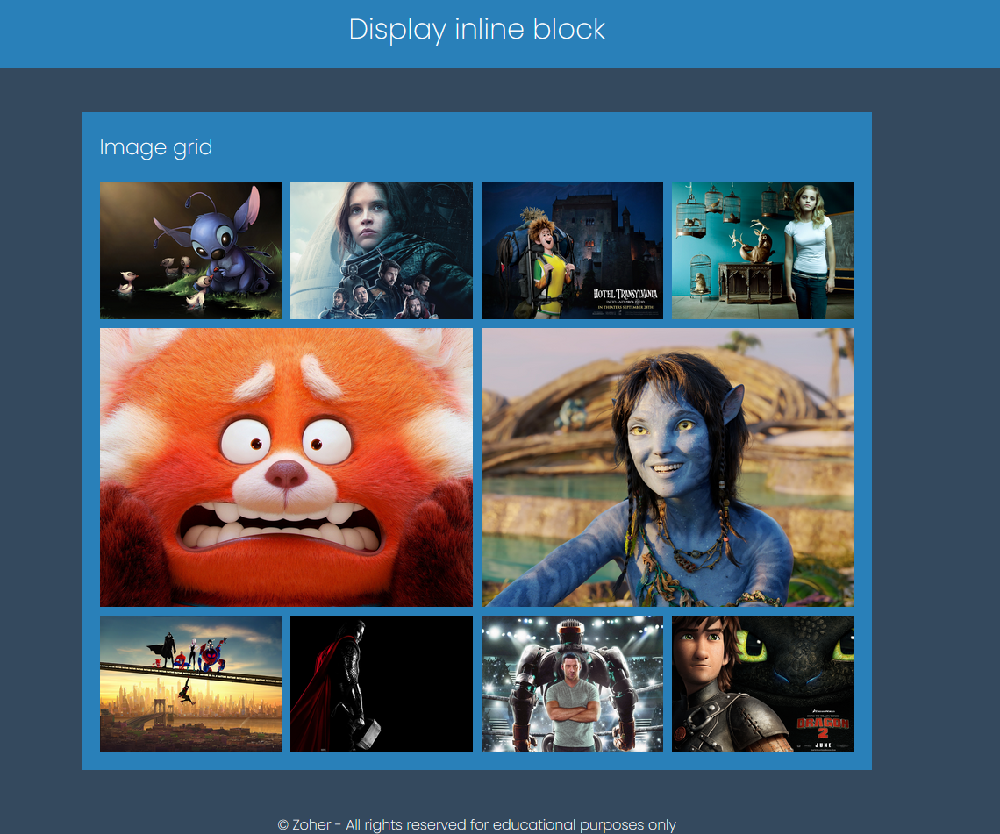

 &copy; Zoher - All rights reserved for educational purposes only
 # les display en css
 la propriété display définit le type d'affichage utilisable 
 pour le rendu d'un element fils : 

 [Plus de détail](https://anilcharif.github.io/diplay_css/)
 cliquer sur le lien 

 ## type de display 
 * Display block
 * Display infinie-block
 * Display inline